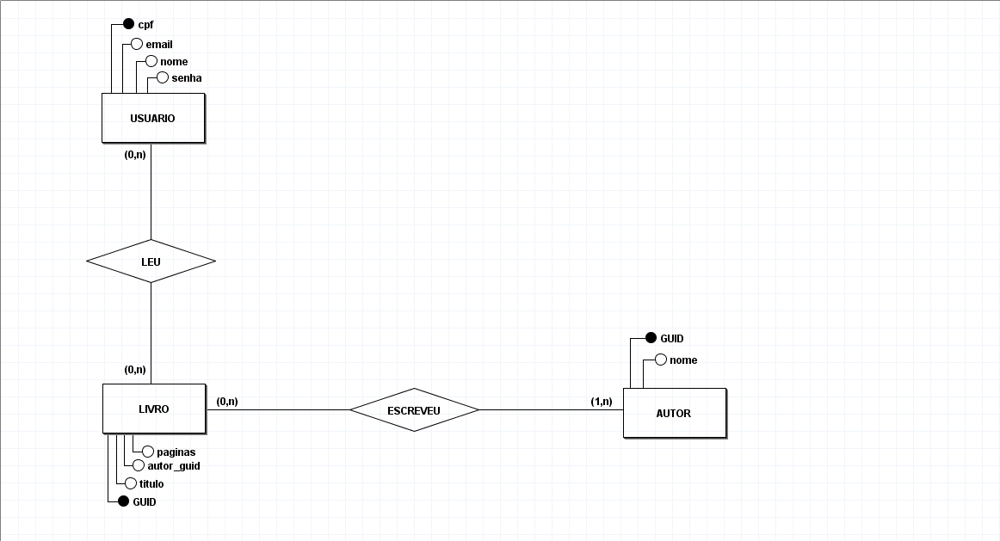

# Biblioteca
Uma API que funciona como uma biblioteca onde temos o CRUD de livros, pensando em arquitetura, como estruturar um projeto simples, mas que leva dentro de si, uma arquitetura onde nós sabemos onde procurar o que queremos, e que seja facíl de entender o que cada rota faz. Por enquanto não foi acabado a parte de livros lidos, ou como seria o modelo da livraria/biblioteca

## Tecnologias utilizadas

- Node.js
- Typescript
- Express
- Oracle

## Modelagem Banco

